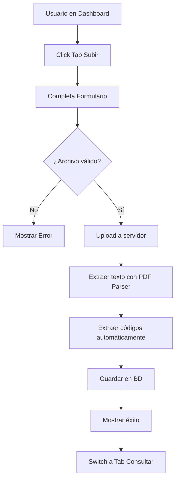
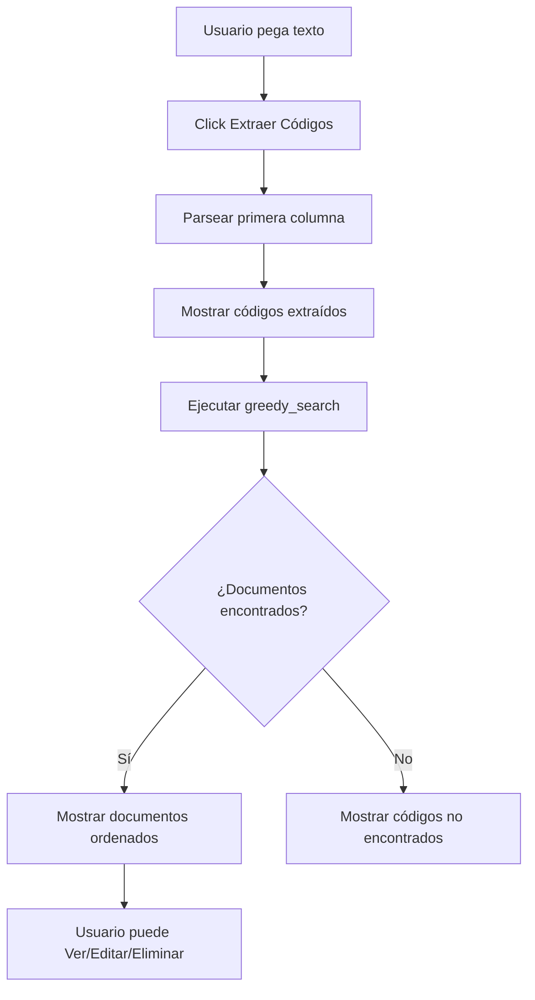
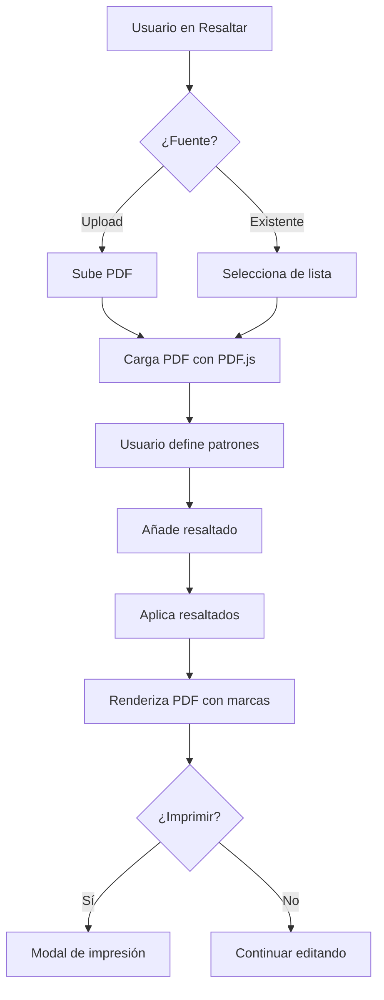

# KINO TRACE - Documentación Técnica Completa
## Guía de Análisis para Agentes Externos

> **Versión**: 2.0 (Post-Optimización 2026-01-23)  
> **Repositorio**: [WILBIdon/MULTI-CLIEN-KINO-NEW2](https://github.com/WILBIdon/MULTI-CLIEN-KINO-NEW2)  
> **Stack**: PHP 7.4+, SQLite, PDF.js, Railway
>
> ⚠️ **Este documento tiene partes desactualizadas** (ej. nombres de acciones de API como `search_single`/`suggest_codes`, que ya no existen — el dispatcher real está en `api.php`). Para una referencia verificada contra el código actual (acciones de API, esquema SQLite completo, inventario de helpers/módulos, inconsistencias conocidas), ver `MAPA_TECNICO.md` en la raíz del repo.

---

## 📋 Índice

1. [Resumen Ejecutivo](#resumen-ejecutivo)
2. [Arquitectura del Sistema](#arquitectura-del-sistema)
3. [Estructura de Directorios](#estructura-de-directorios)
4. [Módulos Principales](#módulos-principales)
5. [Base de Datos](#base-de-datos)
6. [APIs y Endpoints](#apis-y-endpoints)
7. [Flujos de Usuario](#flujos-de-usuario)
8. [Configuración y Deployment](#configuración-y-deployment)
9. [Optimizaciones Recientes](#optimizaciones-recientes)
10. [Análisis de Código](#análisis-de-código)

---

## 📊 Resumen Ejecutivo

**KINO TRACE** es un sistema de gestión documental multi-cliente para rastreo aduanero que permite:
- Búsqueda inteligente de códigos en documentos PDF
- Extracción automática de códigos con IA
- Resaltado visual de términos en PDFs
- Gestión multi-tenant (múltiples clientes aislados)
- Validación cruzada de manifiestos y declaraciones

### Estadísticas del Proyecto
```
Total de archivos: 56 archivos de código
Tamaño total: 0.63 MB
Lenguaje principal: PHP (51 archivos)
CSS: 1 archivo (1,244 líneas)
JavaScript: Embebido en PHP
Base de datos: SQLite por cliente
```

---

## 🏗️ Arquitectura del Sistema

### Patrón Arquitectónico
```
┌─────────────────────────────────────────────────┐
│              NGINX/Apache (Railway)             │
└──────────────────┬──────────────────────────────┘
                   │
┌──────────────────▼──────────────────────────────┐
│              PHP Application                    │
│  ┌──────────┬──────────┬──────────────────┐    │
│  │ Frontend │   API    │  Background Jobs │    │
│  └────┬─────┴────┬─────┴────────┬─────────┘    │
│       │          │              │              │
│  ┌────▼─────┐ ┌─▼──────┐ ┌────▼─────┐         │
│  │  Modules │ │ Helpers│ │  Config  │         │
│  └──────────┘ └────────┘ └──────────┘         │
└──────────────────┬──────────────────────────────┘
                   │
┌──────────────────▼──────────────────────────────┐
│         SQLite Databases (Multi-tenant)         │
│  ┌────────────┬────────────┬──────────────┐    │
│  │ central.db │ client1.db │ client2.db   │    │
│  └────────────┴────────────┴──────────────┘    │
└─────────────────────────────────────────────────┘
                   │
┌──────────────────▼──────────────────────────────┐
│         File Storage (PDFs, Uploads)            │
│           clients/{code}/uploads/               │
└─────────────────────────────────────────────────┘
```

### Flujo de Multi-tenancy
```php
// Cada cliente tiene su propio namespace aislado
clients/
  ├── central.db          # Control de clientes
  ├── KINO/               # Cliente 1
  │   ├── kino.db        # BD del cliente
  │   └── uploads/       # Archivos del cliente
  └── CLIENTE2/           # Cliente 2
      ├── cliente2.db
      └── uploads/
```

---

## 📁 Estructura de Directorios

### Árbol Completo
```
kino-trace/
├── admin/                    # Panel administrativo
│   ├── index.php            # Dashboard admin
│   ├── panel.php            # Gestión de clientes
│   └── backup.php           # Backups de BD
│
├── assets/
│   └── css/
│       └── styles.css       # Estilos centralizados (1,244 líneas)
│
├── clients/                  # Datos multi-tenant
│   ├── central.db           # Control de clientes
│   └── {client_code}/       # Por cada cliente
│       ├── {code}.db        # BD SQLite
│       ├── uploads/         # PDFs subidos
│       └── logs/            # Logs del cliente
│
├── helpers/                  # Utilidades PHP
│   ├── tenant.php           # Multi-tenancy
│   ├── logger.php           # Sistema de logs
│   ├── search_engine.php    # Búsqueda voraz
│   ├── pdf_extractor.php    # Extracción de PDF
│   ├── gemini_ai.php        # Integración IA
│   ├── validator.php        # Validación de datos
│   ├── import_engine.php    # Importación masiva
│   ├── error_codes.php      # Códigos de error
│   └── ai_engine.php        # Motor IA legacy
│
├── includes/                 # Componentes UI
│   ├── header.php           # Header común
│   ├── footer.php           # Footer común
│   ├── sidebar.php          # Menú lateral
│   └── components.php       # ✨ Nuevo: Componentes reutilizables
│
├── modules/                  # Módulos funcionales
│   ├── busqueda/            # Búsqueda simple
│   ├── declaraciones/       # Gestión declaraciones
│   ├── documento/           # Vista de documentos
│   ├── excel_import/        # Importar desde Excel
│   ├── importar/            # Importar documentos
│   ├── indexar/             # Indexación de PDFs
│   ├── lote/                # Carga masiva
│   ├── manifiestos/         # Gestión manifiestos
│   ├── recientes/           # Documentos recientes
│   ├── resaltar/            # Resaltado de PDFs
│   │   ├── index.php        # Interface principal
│   │   ├── viewer.php       # Visor PDF
│   │   └── debug_highlighting.php
│   ├── sincronizar/         # Sincronización
│   ├── subir/               # Subida de documentos
│   └── trazabilidad/        # Validación cruzada
│       ├── dashboard.php
│       ├── validar.php
│       └── vincular.php
│
├── pwa/                      # Progressive Web App
│   ├── manifest.json
│   └── service-worker.js
│
├── autoload.php             # ✨ Nuevo: Sistema autoload
├── optimize_db.php          # ✨ Nuevo: Optimizador BD
├── api.php                  # API REST principal (857 líneas)
├── config.php               # Configuración central
├── index.php                # Dashboard principal
├── login.php                # Autenticación
├── migrate.php              # Migraciones BD
├── Dockerfile               # Container config
├── railway.toml             # Railway deployment
└── README.md                # Documentación
```

---

## 🔧 Módulos Principales

### 1. Sistema de Autenticación
**Archivos**: `login.php`, `logout.php`, `config.php`

```php
// Flujo de autenticación
1. Usuario ingresa código de cliente y contraseña
2. Se valida contra central.db -> control_clientes
3. Se crea sesión con $_SESSION['client_code']
4. Se abre conexión a BD del cliente específico
```

**Tabla de control**:
```sql
control_clientes (
    codigo TEXT PRIMARY KEY,
    nombre TEXT,
    password_hash TEXT,
    titulo TEXT,
    color_primario TEXT,
    color_secundario TEXT,
    activo INTEGER
)
```

### 2. Gestor de Documentos (`index.php`)
**Funcionalidades**:
- ✅ Búsqueda voraz de códigos
- ✅ Subida de documentos con extracción automática
- ✅ Listado y filtrado de documentos
- ✅ Búsqueda por código único
- ✅ Full-text search en PDFs

**Tabs principales**:
1. **Búsqueda Voraz**: Busca múltiples códigos en mínimos documentos
2. **Subir**: Upload con extracción automática de códigos
3. **Consultar**: Lista todos los documentos + full-text search
4. **Búsqueda por Código**: Búsqueda individual con autocompletado

### 3. Motor de Búsqueda (`helpers/search_engine.php`)

**Algoritmo Voraz**:
```php
function greedy_search(PDO $db, array $codes): array
{
    // 1. Buscar todos los documentos que contengan cualquier código
    // 2. Iterar seleccionando el documento que cubra más códigos pendientes
    // 3. Eliminar códigos cubiertos y repetir
    // 4. Retornar mínimo conjunto de documentos
}
```

**Funciones disponibles**:
- `search_by_code()` - Búsqueda simple
- `greedy_search()` - Búsqueda voraz optimizada
- `fulltext_search()` - Búsqueda en texto extraído
- `search_in_pdf_content()` - Búsqueda en PDFs en tiempo real
- `suggest_codes()` - Autocompletado
- `get_search_stats()` - Estadísticas

### 4. Extractor de PDFs (`helpers/pdf_extractor.php`)

**Tecnologías**:
- Smalot\PdfParser (PHP)
- pdftotext (CLI fallback)

**Proceso**:
```
PDF File → Parse → Extract Text → Extract Codes → Store in DB
```

**Patrones de extracción de códigos**:
```php
// Detecta códigos como:
- Alfanuméricos: ABC123, 4560071589663
- Con guiones: ABC-123-XYZ
- Con espacios: ABC 123 XYZ
// Mínimo 3 caracteres
```

### 5. Módulo de Resaltado (`modules/resaltar/`)

**Características**:
- Sube PDF o selecciona de BD
- Define patrones de inicio/fin
- Resalta coincidencias en color
- Renderiza PDF con PDF.js
- Opción de imprimir solo páginas resaltadas

**Tecnología**: PDF.js 3.11.174

### 6. API REST (`api.php`)

**Endpoints principales**:

| Action | Método | Descripción |
|--------|--------|-------------|
| `upload` | POST | Sube documento + códigos |
| `update` | POST | Actualiza documento |
| `delete` | GET/POST | Elimina documento |
| `list` | GET | Lista documentos paginados |
| `get` | GET | Obtiene un documento |
| `search` | GET | Búsqueda voraz |
| `search_single` | GET | Búsqueda código único |
| `fulltext_search` | GET | Búsqueda full-text|
| `suggest_codes` | GET | Autocompletado |
| `extract_codes` | POST | Extrae códigos de PDF |
| `export_csv` | GET | Exporta a CSV |

**Formato de respuesta**:
```json
{
  "success": true,
  "data": {...},
  "message": "Operación exitosa"
}
```

### 7. Sistema de Trazabilidad (`modules/trazabilidad/`)

**Propósito**: Validar correspondencia entre manifiestos y declaraciones

**Flujos**:
1. **Vincular**: Relaciona manifiestos con declaraciones
2. **Validar**: Verifica que códigos coincidan
3. **Dashboard**: Muestra estado de validaciones

---

## 💾 Base de Datos

### Esquema Central (`central.db`)

```sql
CREATE TABLE control_clientes (
    id INTEGER PRIMARY KEY AUTOINCREMENT,
    codigo TEXT UNIQUE NOT NULL,
    nombre TEXT NOT NULL,
    password_hash TEXT NOT NULL,
    titulo TEXT,
    color_primario TEXT DEFAULT '#2563eb',
    color_secundario TEXT DEFAULT '#F87171',
    activo INTEGER DEFAULT 1,
    fecha_creacion TEXT DEFAULT (datetime('now'))
);
```

### Esquema por Cliente (`{client}.db`)

```sql
-- Tabla principal de documentos
CREATE TABLE documentos (
    id INTEGER PRIMARY KEY AUTOINCREMENT,
    tipo TEXT NOT NULL,           -- manifiesto, declaracion, factura
    numero TEXT NOT NULL,         -- Nombre del documento
    fecha DATE NOT NULL,
    fecha_creacion DATETIME DEFAULT CURRENT_TIMESTAMP,
    proveedor TEXT,
    naviera TEXT,
    peso_kg REAL,
    valor_usd REAL,
    ruta_archivo TEXT NOT NULL,  -- Ruta al PDF
    hash_archivo TEXT,            -- SHA256 del archivo
    datos_extraidos TEXT,         -- JSON con texto extraído
    ai_confianza REAL,
    requiere_revision INTEGER DEFAULT 0,
    estado TEXT DEFAULT 'pendiente',
    notas TEXT
);

-- Códigos extraídos de documentos
CREATE TABLE codigos (
    id INTEGER PRIMARY KEY AUTOINCREMENT,
    documento_id INTEGER NOT NULL,
    codigo TEXT NOT NULL,
    descripcion TEXT,
    cantidad INTEGER,
    valor_unitario REAL,
    validado INTEGER DEFAULT 0,
    alerta TEXT,
    FOREIGN KEY(documento_id) REFERENCES documentos(id) ON DELETE CASCADE
);

-- Vínculos entre documentos
CREATE TABLE vinculos (
    id INTEGER PRIMARY KEY AUTOINCREMENT,
    documento_origen_id INTEGER NOT NULL,
    documento_destino_id INTEGER NOT NULL,
    tipo_vinculo TEXT NOT NULL,
    codigos_coinciden INTEGER DEFAULT 0,
    codigos_faltan INTEGER DEFAULT 0,
    codigos_extra INTEGER DEFAULT 0,
    discrepancias TEXT,
    FOREIGN KEY(documento_origen_id) REFERENCES documentos(id) ON DELETE CASCADE,
    FOREIGN KEY(documento_destino_id) REFERENCES documentos(id) ON DELETE CASCADE
);
```

### Índices Optimizados ✨

```sql
-- Agregados por optimize_db.php
CREATE INDEX idx_documentos_tipo ON documentos(tipo);
CREATE INDEX idx_documentos_numero ON documentos(numero);
CREATE INDEX idx_documentos_fecha ON documentos(fecha);
CREATE INDEX idx_documentos_hash ON documentos(hash_archivo);
CREATE INDEX idx_codigos_codigo ON codigos(codigo);
CREATE INDEX idx_codigos_documento_id ON codigos(documento_id);
```

---

## 🔌 APIs y Endpoints

### Formato de Request

**Upload**:
```http
POST /api.php
Content-Type: multipart/form-data

action=upload
tipo=manifiesto
numero=MAN-2024-001
fecha=2024-01-15
proveedor=Empresa XYZ
codes=COD001\nCOD002\nCOD003
file=(binary PDF)
```

**Búsqueda Voraz**:
```http
GET /api.php?action=search&codes=COD001,COD002,COD003
```

**Full-text Search**:
```http
GET /api.php?action=fulltext_search&query=importacion
```

### Manejo de Errores

Códigos definidos en `helpers/error_codes.php`:
```php
'AUTH_001' => 'No autenticado'
'AUTH_002' => 'Sesión expirada'
'DB_001' => 'Error de base de datos'
'FILE_001' => 'Archivo no válido'
'VAL_001' => 'Campos requeridos faltantes'
```

---

## 👤 Flujos de Usuario

### Flujo 1: Subir Documento


### Flujo 2: Búsqueda Voraz


### Flujo 3: Resaltar PDF


---

## ⚙️ Configuración y Deployment

### Variables de Entorno

```bash
# .env (Railway)
DATABASE_URL=sqlite://clients/central.db
UPLOAD_MAX_SIZE=10485760  # 10MB
GEMINI_API_KEY=your_key_here
```

### Railway Configuration

**railway.toml**:
```toml
[build]
builder = "NIXPACKS"

[deploy]
startCommand = "apache2-foreground"
healthcheckPath = "/"
healthcheckTimeout = 100
restartPolicyType = "ON_FAILURE"
```

**Dockerfile**:
```dockerfile
FROM php:8.1-apache
RUN apt-get update && apt-get install -y \
    libfreetype6-dev \
    libjpeg62-turbo-dev \
    libpng-dev \
    poppler-utils
RUN docker-php-ext-install pdo pdo_sqlite
COPY . /var/www/html/
```

### Deployment Steps

1. Push to GitHub
2. Railway auto-deploy
3. Migrate database: `php migrate.php`
4. Create admin client
5. Configure colors & branding

---

## 🚀 Optimizaciones Recientes (2026-01-23)

### 1. Sistema de Autoload ✨

**Archivo**: `autoload.php`

Antes:
```php
require_once __DIR__ . '/config.php';
require_once __DIR__ . '/helpers/tenant.php';
require_once __DIR__ . '/helpers/logger.php';
require_once __DIR__ . '/helpers/search_engine.php';
```

Después:
```php
require_once __DIR__ . '/autoload.php';
// Todos los helpers se cargan automáticamente
```

### 2. Biblioteca de Componentes ✨

**Archivo**: `includes/components.php`

Funciones reutilizables:
```php
render_button('Guardar', 'primary', Icons::check());
render_stat_card(Icons::document(), '152', 'Documentos');
render_form_group('Email', render_input('email', 'email'));
```

### 3. Consolidación CSS ✨

**Antes**: CSS inline en cada archivo PHP  
**Después**: Todo en `assets/css/styles.css`

**Reducción**: 282 líneas eliminadas

### 4. Optimizador de BD ✨

**Archivo**: `optimize_db.php`

```bash
php optimize_db.php        # Optimiza todos
php optimize_db.php KINO   # Optimiza cliente específico
```

Crea índices, ejecuta ANALYZE y VACUUM.

---

## 📊 Análisis de Código

### Métricas de Calidad

```
Total archivos PHP: 51
Líneas totales de código: ~15,000
Promedio por archivo: ~295 líneas

Archivos más grandes:
1. api.php - 857 líneas (necesita refactorización)
2. index.php - 1,089 líneas (reducido de 1,196)
3. modules/resaltar/index.php - 450 líneas (reducido de 624)
```

### Deuda Técnica Identificada

1. **API Monolítica** (`api.php` - 857 líneas)
   - Solución: Separar en clases (ApiDocuments, ApiSearch, ApiCodes)

2. **Duplicación de Código**
   - ✅ **Resuelto**: CSS consolidado
   - 🔄 **Pendiente**: Implementar autoloader en todos los módulos

3. **Falta de Tests**
   - No existen tests automatizados
   - Recomendación: Agregar PHPUnit

4. **Seguridad**
   - ✅ Usar PDO con prepared statements
   - ✅ Hash de passwords con password_hash()
   - ⚠️  Falta validación de uploads (tipo MIME)
   - ⚠️  Falta rate limiting en API

### Patrones de Diseño Usados

- **Multi-tenancy**: Aislamiento por cliente
- **Repository Pattern**: En helpers (search_engine, pdf_extractor)
- **Factory Pattern**: En tenant.php para crear clientes
- **Singleton**: Logger centralizado
- **MVC Simplificado**: Separación lógica en módulos

---

## 🎯 Recomendaciones para Análisis Externo

### Para un agente IA que analice este código:

1. **Empieza por**: `README.md`, `config.php`, `index.php`
2. **Entiende multi-tenancy**: `helpers/tenant.php`
3. **Revisa API**: `api.php` (es el corazón del sistema)
4. **Explora búsqueda**: `helpers/search_engine.php`
5. **Mira módulos**: Cada carpeta en `modules/` es independiente

### Preguntas Guía para el Análisis:

- ¿Cómo se podría modular mejor `api.php`?
- ¿Qué mejoras de seguridad se necesitan?
- ¿Cómo optimizar las búsquedas aún más?
- ¿Qué tests automatizados son prioritarios?
- ¿Cómo mejorar el manejo de errores?

### Archivos Clave para Revisión:

1. `api.php` - API principal
2. `helpers/search_engine.php` - Lógica de búsqueda
3. `helpers/pdf_extractor.php` - Extracción de PDFs
4. `index.php` - Dashboard principal
5. `modules/resaltar/viewer.php` - Visor PDF

---

## 📞 Soporte

- **Repository**: https://github.com/WILBIdon/MULTI-CLIEN-KINO-NEW2
- **Deployment**: Railway
- **Documentación adicional**: Ver `/docs` en el repo

---

**Última actualización**: 2026-01-23  
**Versión**: 2.0 Post-Optimización
