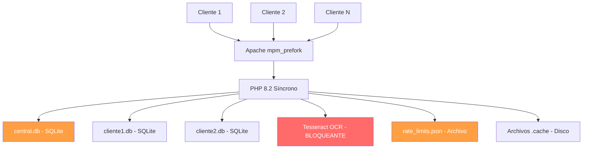

# 🚀 Plan de Mejora Multicliente — KINO-TRACE

> **Estado**: ⏳ Pendiente de ejecución
> **Fecha de análisis**: 2026-02-17
> **Objetivo**: Que el servidor soporte múltiples clientes simultáneos sin trabarse, relentizarse ni colapsar las bases de datos.

---

## 📊 Diagnóstico: 7 Cuellos de Botella Identificados



| # | Problema | Severidad | Archivo afectado |
|---|---------|-----------|------------------|
| 1 | Rate Limiter JSON bloquea CADA request | 🔴 Crítico | `helpers/rate_limiter.php` |
| 2 | OCR síncrono bloquea Apache workers 5-30s | 🔴 Crítico | `modules/resaltar/ocr_text.php` |
| 3 | Migraciones DDL centrales en CADA request | 🟠 Alto | `config.php` |
| 4 | ~15 DDL de esquema por cliente en CADA conexión | 🟠 Alto | `helpers/tenant.php` |
| 5 | Búsqueda full-text hace OCR en vivo por PDF | 🟠 Alto | `helpers/search_engine.php` |
| 6 | Cache en archivos con contención | 🟡 Medio | `helpers/cache_manager.php` |
| 7 | Apache sin configuración de workers | 🟡 Medio | `Dockerfile` |

---

## 📋 Resumen de los 6 Cambios a Ejecutar

| Paso | Archivo | Cambio | Tiempo est. |
|------|---------|--------|-------------|
| 1 | `config.php` | Flag de migración — solo migrar 1 vez | 10 min |
| 2 | `helpers/tenant.php` | `PRAGMA user_version` — cache de migraciones | 15 min |
| 3 | `helpers/rate_limiter.php` | Migrar de JSON a SQLite WAL | 15 min |
| 4 | `helpers/search_engine.php` | Usar `texto_extraido` en vez de OCR en vivo | 10 min |
| 5 | `Dockerfile` | Configurar Apache MaxRequestWorkers | 5 min |
| 6 | `modules/resaltar/ocr_text.php` | Semáforo para limitar OCR concurrente | 10 min |

**Total estimado**: ~1 hora de ejecución

---

## Paso 1: Optimizar `config.php` — Eliminar migraciones repetitivas

**Problema**: Ejecuta `CREATE TABLE IF NOT EXISTS` + 5 `ALTER TABLE` en CADA request.  
**Solución**: Crear un flag file. Solo migrar una vez.

**Archivo**: `config.php`  
**Líneas a reemplazar**: 72-133 (bloque `try/catch` de conexión central)

```php
// Conectar a la base de datos central (SQLite)
try {
    $centralDsn = 'sqlite:' . CENTRAL_DB;
    $centralDb = new PDO($centralDsn);
    $centralDb->setAttribute(PDO::ATTR_ERRMODE, PDO::ERRMODE_EXCEPTION);
    $centralDb->exec("PRAGMA journal_mode=WAL");

    // ======================================================
    // MIGRACIÓN OPTIMIZADA: Solo ejecutar si no se ha hecho
    // ======================================================
    $migrationFlag = CLIENTS_DIR . DIRECTORY_SEPARATOR . '.central_schema_v2';
    if (!file_exists($migrationFlag)) {
        // Crear la tabla de control de clientes si aún no existe
        $centralDb->exec(
            "CREATE TABLE IF NOT EXISTS control_clientes (\n"
            . "    id INTEGER PRIMARY KEY AUTOINCREMENT,\n"
            . "    codigo TEXT UNIQUE,\n"
            . "    nombre TEXT NOT NULL,\n"
            . "    password_hash TEXT NOT NULL,\n"
            . "    titulo TEXT,\n"
            . "    color_primario TEXT,\n"
            . "    color_secundario TEXT,\n"
            . "    activo INTEGER DEFAULT 1,\n"
            . "    fecha_creacion TEXT DEFAULT (datetime('now'))\n"
            . ");"
        );
        // Migración: agregar columnas nuevas
        $newColumns = [
            'email' => "ALTER TABLE control_clientes ADD COLUMN email TEXT",
            'reset_token' => "ALTER TABLE control_clientes ADD COLUMN reset_token TEXT",
            'reset_token_expiry' => "ALTER TABLE control_clientes ADD COLUMN reset_token_expiry TEXT",
            'subdominio' => "ALTER TABLE control_clientes ADD COLUMN subdominio TEXT",
            'password_plain' => "ALTER TABLE control_clientes ADD COLUMN password_plain TEXT",
        ];
        foreach ($newColumns as $col => $sql) {
            try {
                $centralDb->exec($sql);
            } catch (PDOException $e) { /* columna ya existe */
            }
        }

        // Tabla para contenido de página pública por cliente
        $centralDb->exec(
            "CREATE TABLE IF NOT EXISTS pagina_publica (
                codigo TEXT PRIMARY KEY,
                intro_titulo TEXT,
                intro_texto TEXT,
                instrucciones TEXT,
                footer_texto TEXT,
                footer_ubicacion TEXT,
                footer_telefono TEXT,
                footer_url TEXT,
                aviso_legal TEXT
            )"
        );

        // Marcar como migrado
        file_put_contents($migrationFlag, date('Y-m-d H:i:s') . ' - Schema v2');
    }

    // Reset de contraseñas vía variable de entorno
    $resetPw = getenv('ADMIN_RESET_PASSWORD');
    if ($resetPw && $resetPw !== '') {
        $hash = password_hash($resetPw, PASSWORD_DEFAULT);
        $stmt = $centralDb->prepare('UPDATE control_clientes SET password_hash = ?, password_plain = ? WHERE codigo IN (?, ?)');
        $stmt->execute([$hash, $resetPw, 'admin', 'kino']);
    }
} catch (PDOException $e) {
    die('❌ Error conectando a la base central: ' . $e->getMessage());
}
```

> **Nota futura**: Para agregar columnas nuevas, borrar archivo `.central_schema_v2` de `clients/` o renombrar a `_v3`.

---

## Paso 2: Optimizar `helpers/tenant.php` — Cache de migraciones por cliente

**Problema**: `ensure_client_schema()` ejecuta ~15 DDL en CADA apertura de BD.  
**Solución**: `PRAGMA user_version` para ejecutar migraciones SOLO cuando hay cambios.

**Archivo**: `helpers/tenant.php`  
**Reemplazar**: Función `ensure_client_schema()` completa (líneas 414-500)

```php
/**
 * Versión actual del esquema de cliente.
 * Incrementar este número al agregar nuevas migraciones.
 */
define('CLIENT_SCHEMA_VERSION', 2);

/**
 * Asegura que el esquema de la base de datos del cliente esté actualizado.
 * OPTIMIZADO: Usa PRAGMA user_version para ejecutar migraciones SOLO cuando hay cambios.
 *
 * @param PDO $db Conexión a la base de datos del cliente.
 */
function ensure_client_schema(PDO $db): void
{
    // Verificar versión actual del esquema
    $currentVersion = (int) $db->query("PRAGMA user_version")->fetchColumn();

    // Si ya está actualizado, salir inmediatamente (caso más común)
    if ($currentVersion >= CLIENT_SCHEMA_VERSION) {
        return;
    }

    // ============================
    // MIGRACIÓN v1: Tablas base
    // ============================
    if ($currentVersion < 1) {
        $db->exec(
            "CREATE TABLE IF NOT EXISTS configuracion_extraccion (
                id INTEGER PRIMARY KEY AUTOINCREMENT,
                prefix TEXT DEFAULT '',
                terminator TEXT DEFAULT '/',
                min_length INTEGER DEFAULT 4,
                max_length INTEGER DEFAULT 50,
                updated_at DATETIME DEFAULT CURRENT_TIMESTAMP
            )"
        );
        $db->exec("INSERT OR IGNORE INTO configuracion_extraccion (id, prefix, terminator, min_length, max_length) VALUES (1, '', '/', 4, 50)");

        $db->exec(
            "CREATE TABLE IF NOT EXISTS tipos_documento (
                id INTEGER PRIMARY KEY AUTOINCREMENT,
                codigo TEXT NOT NULL UNIQUE,
                nombre TEXT NOT NULL,
                activo INTEGER DEFAULT 1
            )"
        );
        $count = $db->query("SELECT COUNT(*) FROM tipos_documento")->fetchColumn();
        if ($count == 0) {
            $db->exec("INSERT INTO tipos_documento (codigo, nombre) VALUES 
                ('documento', 'Documento General'),
                ('manifiesto', 'Manifiesto'),
                ('declaracion', 'Declaración'),
                ('factura', 'Factura')");
        }

        $db->exec(
            "CREATE TABLE IF NOT EXISTS log_actividad (
                id INTEGER PRIMARY KEY AUTOINCREMENT,
                accion TEXT NOT NULL,
                detalle TEXT,
                ip TEXT,
                fecha DATETIME DEFAULT CURRENT_TIMESTAMP
            )"
        );
    }

    // ============================
    // MIGRACIÓN v2: Columnas e índices
    // ============================
    if ($currentVersion < 2) {
        $tableCheck = $db->query("SELECT name FROM sqlite_master WHERE type='table' AND name='documentos'")->fetchColumn();
        if ($tableCheck) {
            $cols = $db->query("PRAGMA table_info(documentos)")->fetchAll(PDO::FETCH_COLUMN, 1);
            if (!in_array('texto_extraido', $cols)) {
                $db->exec("ALTER TABLE documentos ADD COLUMN texto_extraido TEXT");
            }
            if (!in_array('estado_extraccion', $cols)) {
                $db->exec("ALTER TABLE documentos ADD COLUMN estado_extraccion TEXT DEFAULT 'pendiente'");
            }
            if (!in_array('original_path', $cols)) {
                $db->exec("ALTER TABLE documentos ADD COLUMN original_path TEXT");
            }

            $db->exec("CREATE INDEX IF NOT EXISTS idx_documentos_numero ON documentos(numero)");
            $db->exec("CREATE INDEX IF NOT EXISTS idx_documentos_tipo ON documentos(tipo)");
            $db->exec("CREATE INDEX IF NOT EXISTS idx_documentos_fecha ON documentos(fecha)");
            $db->exec("CREATE INDEX IF NOT EXISTS idx_documentos_estado ON documentos(estado)");
        }

        $codigosExists = $db->query("SELECT name FROM sqlite_master WHERE type='table' AND name='codigos'")->fetchColumn();
        if ($codigosExists) {
            $db->exec("CREATE INDEX IF NOT EXISTS idx_codigos_documento_id ON codigos(documento_id)");
            $db->exec("CREATE INDEX IF NOT EXISTS idx_codigos_codigo ON codigos(codigo)");
        }
        $vinculosExists = $db->query("SELECT name FROM sqlite_master WHERE type='table' AND name='vinculos'")->fetchColumn();
        if ($vinculosExists) {
            $db->exec("CREATE INDEX IF NOT EXISTS idx_vinculos_origen ON vinculos(documento_origen_id)");
            $db->exec("CREATE INDEX IF NOT EXISTS idx_vinculos_destino ON vinculos(documento_destino_id)");
        }
    }

    // Marcar versión actualizada
    $db->exec("PRAGMA user_version = " . CLIENT_SCHEMA_VERSION);
}
```

> **Nota futura**: Para agregar migraciones, incrementar `CLIENT_SCHEMA_VERSION` a 3 y agregar bloque `if ($currentVersion < 3)`.

---

## Paso 3: Rate Limiter — Migrar de JSON a SQLite

**Problema**: Archivo JSON con `LOCK_EX` crea cuello de botella serial en CADA request API.  
**Solución**: SQLite con WAL mode maneja concurrencia mucho mejor.

**Archivo**: `helpers/rate_limiter.php`  
**Reemplazar**: TODO el contenido del archivo

```php
<?php
/**
 * Rate Limiter Middleware v2 - SQLite Backend
 * 
 * OPTIMIZADO: Usa SQLite con WAL mode en vez de JSON con LOCK_EX.
 * Esto elimina el cuello de botella serial que bloqueaba requests concurrentes.
 */

class RateLimiter
{
    private const LIMIT = 100;
    private const WINDOW = 60;

    private static $db = null;

    private static function init(): void
    {
        if (self::$db !== null) {
            return;
        }

        $dir = CLIENTS_DIR . '/logs';
        if (!is_dir($dir)) {
            mkdir($dir, 0755, true);
        }

        $dbPath = $dir . '/rate_limiter.db';
        self::$db = new PDO('sqlite:' . $dbPath);
        self::$db->setAttribute(PDO::ATTR_ERRMODE, PDO::ERRMODE_EXCEPTION);
        self::$db->exec("PRAGMA journal_mode=WAL");
        self::$db->exec("PRAGMA synchronous=NORMAL");

        self::$db->exec("CREATE TABLE IF NOT EXISTS rate_limits (
            ip_hash TEXT PRIMARY KEY,
            attempts INTEGER DEFAULT 1,
            window_start INTEGER NOT NULL
        )");
    }

    public static function check(?string $ip = null): array
    {
        self::init();

        $ip = $ip ?? self::getClientIp();
        $key = md5($ip);
        $now = time();
        $windowStart = $now - self::WINDOW;

        // Limpiar entradas viejas (probabilístico 2%)
        if (rand(1, 100) <= 2) {
            self::$db->exec("DELETE FROM rate_limits WHERE window_start < " . ($now - 3600));
        }

        // Incrementar o insertar atómicamente
        $stmt = self::$db->prepare(
            "INSERT INTO rate_limits (ip_hash, attempts, window_start)
             VALUES (:key, 1, :now)
             ON CONFLICT(ip_hash) DO UPDATE SET
                attempts = CASE
                    WHEN window_start < :window_start THEN 1
                    ELSE attempts + 1
                END,
                window_start = CASE
                    WHEN window_start < :window_start THEN :now
                    ELSE window_start
                END"
        );
        $stmt->execute([
            ':key' => $key,
            ':now' => $now,
            ':window_start' => $windowStart
        ]);

        // Leer estado actual
        $stmt = self::$db->prepare("SELECT attempts, window_start FROM rate_limits WHERE ip_hash = ?");
        $stmt->execute([$key]);
        $row = $stmt->fetch(PDO::FETCH_ASSOC);

        $attempts = $row['attempts'] ?? 1;
        $resetTime = ($row['window_start'] ?? $now) + self::WINDOW;
        $remaining = max(0, self::LIMIT - $attempts);

        if ($attempts > self::LIMIT) {
            $retryAfter = max(1, $resetTime - $now);
            return [
                'allowed' => false,
                'limit' => self::LIMIT,
                'remaining' => 0,
                'retry_after' => $retryAfter,
                'reset_time' => $resetTime,
                'message' => "Demasiados requests. Intenta en $retryAfter segundos."
            ];
        }

        return [
            'allowed' => true,
            'limit' => self::LIMIT,
            'remaining' => $remaining,
            'reset_time' => $resetTime
        ];
    }

    public static function middleware(): void
    {
        $result = self::check();

        if (!headers_sent()) {
            header('X-RateLimit-Limit: ' . $result['limit']);
            header('X-RateLimit-Remaining: ' . $result['remaining']);
            if (isset($result['reset_time'])) {
                header('X-RateLimit-Reset: ' . $result['reset_time']);
            }
        }

        if (!$result['allowed']) {
            if (!headers_sent()) {
                header('HTTP/1.1 429 Too Many Requests');
                header('Retry-After: ' . $result['retry_after']);
                header('Content-Type: application/json');
            }

            echo json_encode([
                'error' => $result['message'],
                'retry_after' => $result['retry_after']
            ]);

            if (class_exists('Logger')) {
                Logger::warning('Rate limit exceeded', [
                    'ip' => self::getClientIp(),
                    'user_agent' => $_SERVER['HTTP_USER_AGENT'] ?? 'Unknown'
                ]);
            }

            if (defined('PHPUNIT_RUNNING')) {
                throw new \RuntimeException('RATE_LIMIT_EXCEEDED');
            }

            exit;
        }
    }

    private static function getClientIp(): string
    {
        $headers = [
            'HTTP_CF_CONNECTING_IP',
            'HTTP_X_FORWARDED_FOR',
            'HTTP_X_REAL_IP',
            'REMOTE_ADDR'
        ];

        foreach ($headers as $header) {
            if (isset($_SERVER[$header]) && !empty($_SERVER[$header])) {
                $ip = $_SERVER[$header];
                if (strpos($ip, ',') !== false) {
                    $ips = explode(',', $ip);
                    $ip = trim($ips[0]);
                }
                if (filter_var($ip, FILTER_VALIDATE_IP)) {
                    return $ip;
                }
            }
        }

        return '0.0.0.0';
    }

    public static function reset(string $ip): void
    {
        self::init();
        $stmt = self::$db->prepare("DELETE FROM rate_limits WHERE ip_hash = ?");
        $stmt->execute([md5($ip)]);
    }

    public static function getStats(): array
    {
        self::init();
        $now = time();
        $windowStart = $now - self::WINDOW;

        $total = (int) self::$db->query("SELECT COUNT(*) FROM rate_limits WHERE window_start >= $windowStart")->fetchColumn();
        $blocked = (int) self::$db->query("SELECT COUNT(*) FROM rate_limits WHERE attempts > " . self::LIMIT . " AND window_start >= $windowStart")->fetchColumn();
        $top = self::$db->query("SELECT attempts, window_start FROM rate_limits WHERE window_start >= $windowStart ORDER BY attempts DESC LIMIT 10")->fetchAll(PDO::FETCH_ASSOC);

        return [
            'total_ips' => $total,
            'blocked_ips' => $blocked,
            'top_requesters' => $top
        ];
    }
}
```

> **Después del deploy**: Puedes eliminar manualmente `clients/logs/rate_limits.json` (ya no se usa).

---

## Paso 4: Búsqueda full-text — Usar `texto_extraido` en vez de OCR en vivo

**Problema**: `search_in_pdf_content()` ejecuta OCR en CADA PDF. Un cliente con 500 docs = 15+ min.  
**Solución**: Buscar en la columna `texto_extraido` que ya existe en la BD.

**Archivo**: `helpers/search_engine.php`  
**Reemplazar**: Función `search_in_pdf_content()` completa (líneas 233-317)

```php
/**
 * Búsqueda avanzada dentro del contenido de PDFs.
 * 
 * OPTIMIZADO v2: Busca en la columna texto_extraido de la BD en vez de
 * re-extraer texto de cada PDF con OCR. Reduce de minutos a milisegundos.
 *
 * @param PDO $db Conexión a la base de datos.
 * @param string $searchTerm Término a buscar dentro de los PDFs.
 * @param string $clientCode Código del cliente para ubicar los archivos.
 * @return array Documentos con coincidencias y snippets del texto.
 */
function search_in_pdf_content(PDO $db, string $searchTerm, string $clientCode): array
{
    $searchTerm = trim($searchTerm);
    if ($searchTerm === '' || strlen($searchTerm) < 3) {
        return [];
    }

    $lowerQuery = '%' . strtolower($searchTerm) . '%';

    $stmt = $db->prepare("
        SELECT id, tipo, numero, fecha, proveedor, ruta_archivo,
               texto_extraido, datos_extraidos
        FROM documentos
        WHERE LOWER(texto_extraido) LIKE ?
           OR LOWER(datos_extraidos) LIKE ?
        ORDER BY fecha DESC
        LIMIT 200
    ");

    $stmt->execute([$lowerQuery, $lowerQuery]);
    $documents = $stmt->fetchAll(PDO::FETCH_ASSOC);

    $results = [];
    foreach ($documents as $doc) {
        $text = $doc['texto_extraido'] ?? '';
        if (empty($text)) {
            $json = json_decode($doc['datos_extraidos'] ?? '{}', true);
            $text = $json['text'] ?? ($doc['datos_extraidos'] ?? '');
        }

        $pos = stripos($text, $searchTerm);
        if ($pos === false) {
            $snippet = '(Coincidencia encontrada en datos extraídos)';
            $occurrences = 1;
        } else {
            $snippetStart = max(0, $pos - 80);
            $snippetEnd = min(strlen($text), $pos + strlen($searchTerm) + 80);
            $snippet = substr($text, $snippetStart, $snippetEnd - $snippetStart);
            $snippet = preg_replace('/\s+/', ' ', trim($snippet));

            if ($snippetStart > 0) $snippet = '...' . $snippet;
            if ($snippetEnd < strlen($text)) $snippet .= '...';

            $occurrences = substr_count(strtolower($text), strtolower($searchTerm));
        }

        $results[] = [
            'id' => $doc['id'],
            'tipo' => $doc['tipo'],
            'numero' => $doc['numero'],
            'fecha' => $doc['fecha'],
            'proveedor' => $doc['proveedor'],
            'ruta_archivo' => $doc['ruta_archivo'],
            'snippet' => $snippet,
            'occurrences' => $occurrences,
            'search_term' => $searchTerm
        ];
    }

    usort($results, function ($a, $b) {
        return $b['occurrences'] - $a['occurrences'];
    });

    return $results;
}
```

---

## Paso 5: Optimizar Apache workers en Dockerfile

**Problema**: Sin configuración, Apache crea demasiados/pocos workers para 512MB.  
**Solución**: Configurar `mpm_prefork` explícitamente.

**Archivo**: `Dockerfile`  
**Agregar DESPUÉS de la línea 22** (`RUN a2dismod mpm_event...`):

```dockerfile
# Optimizar Apache workers para Railway (512MB RAM)
RUN echo '<IfModule mpm_prefork_module>\n\
    StartServers          3\n\
    MinSpareServers       2\n\
    MaxSpareServers       5\n\
    MaxRequestWorkers     15\n\
    MaxConnectionsPerChild 1000\n\
</IfModule>' > /etc/apache2/mods-available/mpm_prefork.conf
```

---

## Paso 6: Semáforo OCR — Limitar procesos concurrentes de Tesseract

**Problema**: 10 usuarios pidiendo OCR = 10 Tesseract en paralelo = servidor muerto.  
**Solución**: Máximo 2 OCR simultáneos, los demás reciben "reintente en unos segundos".

**Archivo**: `modules/resaltar/ocr_text.php`  
**Agregar ANTES de la línea ~118** (`if (function_exists('extract_with_ocr_coordinates'))`):

```php
    // ============================================
    // SEMÁFORO OCR: Limitar a 2 procesos concurrentes
    // Evita que múltiples OCR saturen CPU y RAM
    // ============================================
    $maxConcurrentOcr = 2;
    $semaphoreDir = CLIENTS_DIR . '/.ocr_semaphore';
    if (!is_dir($semaphoreDir)) {
        @mkdir($semaphoreDir, 0777, true);
    }

    // Limpiar locks muertos (más de 120 segundos)
    $existingLocks = glob($semaphoreDir . '/*.lock');
    foreach ($existingLocks as $lockFile) {
        if (time() - filemtime($lockFile) > 120) {
            @unlink($lockFile);
        }
    }

    // Verificar cuántos OCR están corriendo
    $activeLocks = glob($semaphoreDir . '/*.lock');
    if (count($activeLocks) >= $maxConcurrentOcr) {
        echo json_encode([
            'success' => true,
            'match_count' => 0,
            'matches' => [],
            'highlights' => [],
            'text' => '',
            'terms_searched' => $terms,
            'ocr_busy' => true,
            'message' => 'OCR ocupado, reintente en unos segundos'
        ]);
        exit;
    }

    // Adquirir lock
    $lockId = uniqid('ocr_', true);
    $lockFile = $semaphoreDir . '/' . $lockId . '.lock';
    file_put_contents($lockFile, getmypid());

    // Registrar cleanup al finalizar
    register_shutdown_function(function () use ($lockFile) {
        @unlink($lockFile);
    });
```

---

## ✅ Verificación post-implementación

| Paso | Qué verificar | Cómo |
|------|---------------|------|
| 1 | Flag creado | Confirmar que existe `clients/.central_schema_v2` |
| 2 | Schema version | Desde SQLite: `PRAGMA user_version` = 2 |
| 3 | Rate limiter DB | Confirmar que existe `clients/logs/rate_limiter.db` |
| 4 | Búsqueda rápida | Buscar texto completo, debe retornar en < 1s |
| 5 | Workers Apache | En logs: `MaxRequestWorkers` configurado |
| 6 | Semáforo OCR | Carpeta `.ocr_semaphore` se crea y locks aparecen/desaparecen |

---

## 📈 Impacto Estimado

| Métrica | Actual | Después |
|---------|--------|---------|
| Clientes simultáneos | ~3-5 | ~15-20 |
| Queries DDL por request | ~20 | ~1 |
| Búsqueda full-text | 5-15 min | < 1 seg |
| OCR concurrentes max | Sin límite (crash) | 2 controlados |

---

> **Para ejecutar**: Decirle al asistente "ejecutar plan mejora multicliente" y aplicará todos los cambios en orden.  
> **Antes de ejecutar**: Se recomienda hacer `/backup` para tener punto de restauración.
